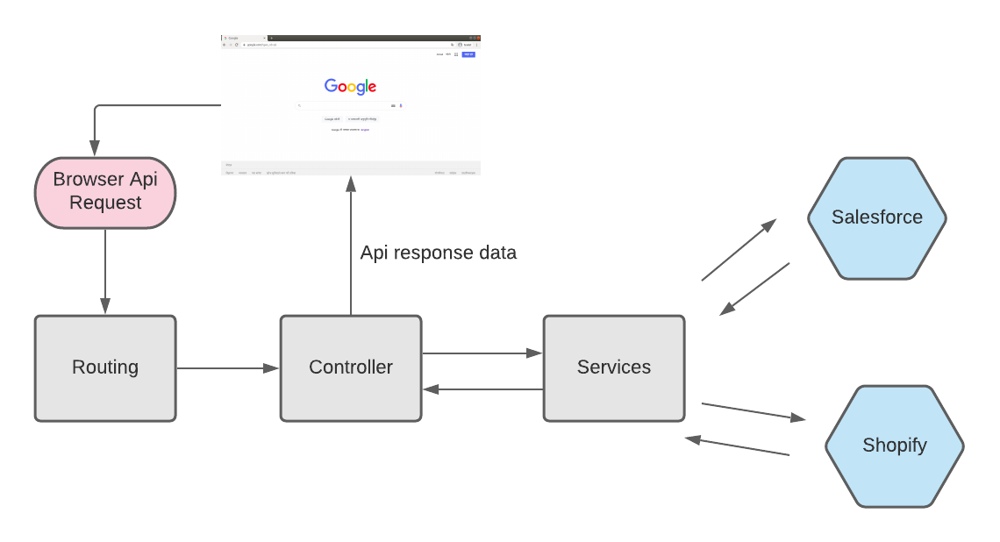

# REVEA MIDDLEWARE

Welcome to revea middleware. This application helps to push the data to salesforce or any other platforms.

# Application API's Doc
https://docs.google.com/spreadsheets/d/13IekqR902JGn477007sywL6eqToG3HYmjxkEBp5l4dA/edit?usp=sharing


## Requirements
- [Node.js](https://yarnpkg.com/en/docs/install)
- [Yarn](https://yarnpkg.com/en/docs/install)
- [NPM](https://docs.npmjs.com/getting-started/installing-node)

## SDK Libraries
- **jsforce**: This library is a salesforce sdk. which helps to push data into salesforce.
## Getting Started
Clone the repository.
```
git clone git@github.com:leapfrogtechnology/revea-backend.git

cd revea-backend
```

Package installation.
```
npm install
```

Setup the environment variables.

```
cp .env.example .env
```
Update the .env file as required. Pay special attention to the missing fields.

To run the app
```
yarn dev
```

## Available Commands
To check the code whether it is following the standard or not.
```
yarn lint
```

Fix all the code if it is not following the coding standard.

```
yarn lint:fix
```

To run the code in production
```
yarn build
```

## Directory Structure

- controllers
- core
    - exceptions
    - middleware
    - utils
- lang
- services
    - salesforce
- validators
- app.js
- index.js
- route.js

## Application Architecture

